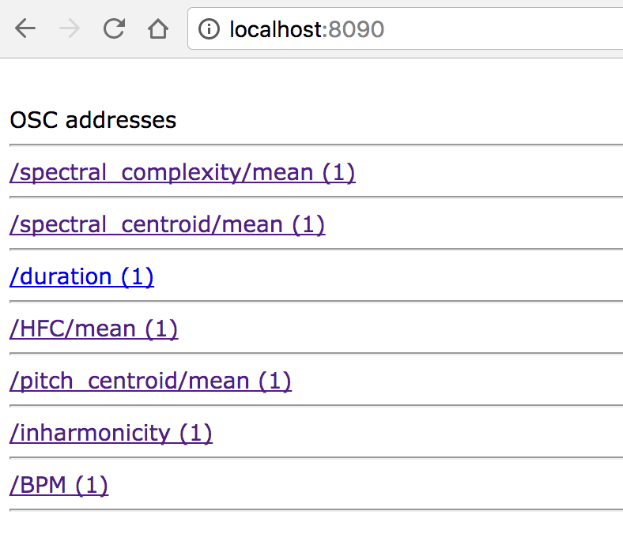
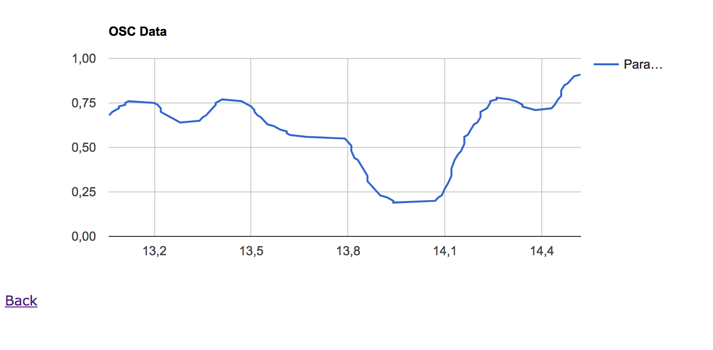

# Experimental osc-party

Fight for your right (to OSC party)

# Docker image build
```
$ docker build -t osc-party-app .
```

# Run
```
$ docker run -it --rm -p 8090:80 -p 12345:12345 osc-party-app /bin/bash
$ python2 /var/www/html/pyOSCmon.py &
$ /usr/sbin/apache2ctl -D FOREGROUND
```

http://localhost:8090

OSC port: 12345

# Dependencies (without docker image)

* PHP
* Apache
* Python2

```
$ apt-get install -y \
  python \
  python-pip \
  python-dev \
  build-essential \
  liblo-dev
  
$ pip2 install --upgrade pip
$ pip2 install cython 
$ pip2 install pyliblo 
$ pip2 install simplejson
$ pip2 install -U https://github.com/google/google-visualization-python/zipball/master

# php7
sudo apt-get install -y apache2 php7.0 libapache2-mod-php7.0

# @ Raspberry (php5)
sudo apt-get install -y apache2 php5.0 libapache2-mod-php5

sudo cp -R src/* /var/www/html/

cd /var/www/html
sudo wget http://code.jquery.com/jquery-1.8.2.min.js
sudo wget https://www.google.com/jsapi
```
# Example



